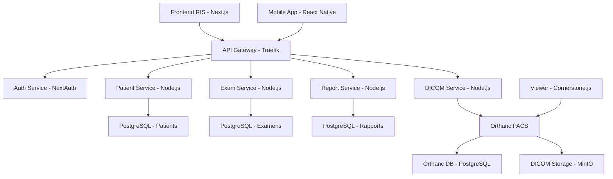

# PRD - Système RIS-PACS Open Source

## 📋 **Product Requirements Document**
**Version** : 1.0  
**Date** : Août 2025  
**Équipe** : Développement Médical Open Source  

---

## 🎯 **1. VISION PRODUIT**

### **1.1 Objectif Global**
Développer une plateforme RIS (Radiology Information System) moderne et open-source reproduisant les fonctionnalités des solutions commerciales françaises comme **EDL** (Expert Digital Life), intégrée avec un PACS Orthanc et des visualisateurs médicaux avancés.

### **1.2 Mission**
Créer un écosystème radiologique complet, gratuit et évolutif pour les établissements de santé, centres d'imagerie médicale et institutions d'enseignement, avec un workflow numérique optimal du dossier patient à l'archivage des examens.

### **1.3 Valeur Ajoutée**
- **Coût** : Alternative gratuite aux solutions propriétaires (économie de 50k-200k€/an)
- **Flexibilité** : Code source ouvert et personnalisable
- **Standards** : Conformité DICOM, HL7, FHIR
- **Modernité** : Technologies récentes et architecture cloud-ready
- **Français** : Adaptation aux spécificités réglementaires françaises

---

## 🏗️ **2. ARCHITECTURE TECHNIQUE**

### **2.1 Stack Technologique Moderne**

#### **Frontend - Interface RIS**
```typescript
Framework : Next.js 14 (React 18)
Language : TypeScript 5.0+
UI Library : shadcn/ui + Tailwind CSS
State Management : Zustand + React Query
Authentication : NextAuth.js + JWT
Charts/Analytics : Recharts + D3.js
Medical Viewer : Cornerstone.js 3D
```

#### **Backend - API RIS**
```typescript
Runtime : Node.js 20+ / Bun
Framework : Fastify + tRPC
Language : TypeScript 5.0+
Database : PostgreSQL 15 + Prisma ORM
Cache : Redis 7
Message Queue : BullMQ
File Storage : MinIO (S3-compatible)
Search : Elasticsearch 8
```

#### **PACS - Orthanc**
```yaml
Core : Orthanc 1.12.8+
Database : PostgreSQL 15
Plugins :
  - DICOMweb (API REST)
  - WebViewer (visualisation)
  - PostgreSQL (storage)
  - Transfers (performance)
  - Python (scripting)
```

#### **Infrastructure**
```yaml
Containerisation : Docker + Docker Compose
Orchestration : Kubernetes (production)
Reverse Proxy : Traefik v3
Monitoring : Grafana + Prometheus
Logs : ELK Stack (Elasticsearch, Logstash, Kibana)
CI/CD : GitHub Actions
```

### **2.2 Architecture Microservices**



---

## 🏥 **3. FONCTIONNALITÉS RIS - INSPIRATION EDL**

### **3.1 Gestion des Patients**

#### **Dossier Patient Unifié**
- **Identité** : Démographie complète, INS, carte vitale
- **Historique** : Examens précédents, pathologies, allergies
- **Documents** : Ordonnances, comptes-rendus, courriers
- **Assurance** : Prise en charge, tiers-payant, AME
- **Rendez-vous** : Planning, rappels automatiques

#### **Recherche Avancée**
```typescript
interface PatientSearch {
  identity: string;        // Nom, prénom, IPP
  birthDate: Date;        // Date de naissance
  phoneNumber: string;    // Téléphone
  socialSecurity: string; // N° Sécurité Sociale
  examType: string;       // Type d'examen
  dateRange: DateRange;   // Période
  status: PatientStatus;  // Statut patient
}
```

### **3.2 Gestion des Examens**

#### **Workflow EDL Reproduit**
```
Prescription → Planification → Acquisition → Lecture → Validation → Diffusion
```

#### **Types d'Examens**
- **Radiologie Conventionnelle** : Thorax, ASP, membres
- **Scanner** : Crâne, thorax, abdomen, membres
- **IRM** : Encéphale, rachis, articulations
- **Échographie** : Abdominale, pelvienne, thyroïde
- **Mammographie** : Dépistage, diagnostic
- **Interventionnel** : Ponctions, infiltrations

#### **Planning Intelligent**
```typescript
interface ExamScheduling {
  modality: ModalityType;     // Modalité d'acquisition
  duration: number;           // Durée estimée
  preparation: string[];      // Préparation patient
  contrast: boolean;          // Produit de contraste
  priority: PriorityLevel;    // Urgence/programmé
  practitioner: string;       // Radiologue assigné
  technician: string;         // Manipulateur assigné
  room: string;              // Salle d'examen
}
```

### **3.3 Interface Radiologue**

#### **Worklist Personnalisée**
- **Tri Multi-critères** : Date, priorité, modalité, statut
- **Filtres Avancés** : Médecin prescripteur, pathologie, urgence
- **Groupement** : Par patient, par médecin, par modalité
- **Bookmarks** : Cas favoris, cas complexes

#### **Environnement de Lecture**
```typescript
interface ReadingEnvironment {
  viewer: {
    layout: 'single' | 'compare' | 'grid';
    tools: DicomTools[];
    presets: WindowPreset[];
    annotations: AnnotationTool[];
  };
  priors: {
    autoLoad: boolean;
    comparison: 'side-by-side' | 'overlay';
    dateRange: number; // mois
  };
  dictation: {
    voiceRecognition: boolean;
    templates: ReportTemplate[];
    macros: string[];
  };
}
```

### **3.4 Comptes-Rendus Structurés**

#### **Templates par Modalité**
```typescript
interface ReportTemplate {
  modality: ModalityType;
  examination: ExamType;
  sections: {
    indication: string;
    technique: string;
    findings: StructuredFindings;
    impression: string;
    recommendation: string;
  };
  codes: {
    ccam: string[];     // Codes CCAM
    cim10: string[];    // Codes CIM-10
    adicap: string[];   // Codes ADICAP
  };
}
```

#### **Validation Hiérarchique**
- **Junior** → **Senior** → **Validé**
- **Notifications** : Email, SMS, push
- **Délais** : SLA par type d'examen
- **Traçabilité** : Audit trail complet

---

## 🔄 **4. INTÉGRATIONS SYSTÈME**

### **4.1 RIS ↔ PACS (Orthanc)**

#### **Protocoles d'Intégration**
```yaml
DICOM Services:
  - C-FIND: Recherche d'examens
  - C-MOVE: Récupération d'images
  - C-STORE: Envoi d'images
  - C-ECHO: Test de connectivité

DICOMweb APIs:
  - QIDO-RS: Query based on DICOM Objects
  - WADO-RS: Web Access to DICOM Objects  
  - STOW-RS: Store Over the Web

HL7 Messages:
  - ORM: Order Message
  - ORU: Observation Result
  - ADT: Patient Administration
```

#### **Synchronisation Temps Réel**
```typescript
interface DicomIntegration {
  modalityWorklist: {
    autoGenerate: boolean;
    schedule: CronExpression;
    filters: MWLFilters;
  };
  
  imageReceived: {
    webhook: string;
    processing: ImageProcessingPipeline;
    notification: NotificationConfig;
  };
  
  reportExport: {
    format: 'PDF' | 'DICOM-SR' | 'FHIR';
    destination: 'PACS' | 'HIS' | 'DMP';
    schedule: 'immediate' | 'batch';
  };
}
```

### **4.2 Visualisateurs Médicaux**

#### **Intégration Cornerstone.js**
```typescript
interface ViewerIntegration {
  launcher: {
    embedded: boolean;      // Dans le RIS
    standalone: boolean;    // Fenêtre séparée
    url: string;           // Deep linking
  };
  
  features: {
    tools: ViewerTool[];
    measurements: boolean;
    annotations: boolean;
    sharing: boolean;
    printing: boolean;
  };
  
  performance: {
    streaming: boolean;     // Progressive loading
    caching: boolean;      // Local cache
    gpu: boolean;          // GPU acceleration
  };
}
```

#### **Viewers Supportés**
- **Cornerstone.js 3D** : Viewer moderne intégré
- **OHIF Viewer** : Viewer avancé standalone  
- **Orthanc Stone** : Viewer natif C++
- **Weasis** : Viewer Java pour poste de travail

---

## 📊 **5. FONCTIONNALITÉS MÉTIER**

### **5.1 Tableau de Bord EDL-Style**

#### **Métriques Temps Réel**
```typescript
interface Dashboard {
  productivity: {
    examsPerDay: number;
    avgReportTime: number;    // minutes
    backlog: number;          // examens en attente
    radiologists: StaffMetrics[];
  };
  
  quality: {
    reportingDelay: number;   // heures
    validationRate: number;   // %
    amendmentRate: number;    // %
    patientSatisfaction: number;
  };
  
  activity: {
    modalityUsage: ModalityStats[];
    examTypes: ExamTypeStats[];
    referrers: ReferrerStats[];
    revenue: RevenueMetrics;
  };
}
```

#### **Alertes Intelligentes**
- **SLA** : Dépassement délais de lecture
- **Qualité** : Taux d'amendement élevé
- **Technique** : Panne modalité, erreur PACS
- **Réglementaire** : Doses d'irradiation, RGPD

### **5.2 Gestion des Doses**

#### **Conformité Réglementaire**
```typescript
interface DoseMonitoring {
  collection: {
    doseData: DicomDoseMetrics;
    patientRegistry: PatientDoseHistory;
    modalityQA: QualityAssurance;
  };
  
  analysis: {
    drl: DiagnosticReferencelevels;
    alerts: DoseAlertSystem;
    reports: DoseReporting;
  };
  
  compliance: {
    ansm: boolean;          // Réglementation française
    iaea: boolean;          // Standards internationaux
    export: ExportFormat[]; // Formats d'export
  };
}
```

### **5.3 Intelligence Artificielle**

#### **Aide au Diagnostic**
```typescript
interface AIIntegration {
  screening: {
    lungCancer: boolean;     // Dépistage poumon
    breastCancer: boolean;   // Dépistage sein
    osteoporosis: boolean;   // Ostéoporose
  };
  
  detection: {
    fractures: boolean;      // Détection fractures
    nodules: boolean;        // Nodules pulmonaires
    hemorrhage: boolean;     // Hémorragie cérébrale
  };
  
  workflow: {
    prioritization: boolean; // Priorisation urgences
    hanging: boolean;        // Accrochage automatique
    measurements: boolean;   // Mesures automatiques
  };
}
```

---

## 🔐 **6. SÉCURITÉ ET CONFORMITÉ**

### **6.1 Sécurité Technique**

#### **Architecture Sécurisée**
```yaml
Authentication:
  - OAuth 2.0 / OpenID Connect
  - SAML 2.0 (AD/LDAP)
  - MFA (TOTP/SMS/Biométrie)
  - Certificats carte CPS

Authorization:
  - RBAC (Role-Based Access Control)
  - ABAC (Attribute-Based Access Control)
  - Permissions granulaires
  - Audit trail complet

Data Protection:
  - Chiffrement AES-256
  - TLS 1.3
  - HSM pour clés critiques
  - Pseudonymisation RGPD
```

### **6.2 Conformité Réglementaire**

#### **Standards Médicaux**
- **DICOM 3.0** : Communication images médicales
- **HL7 FHIR R4** : Interopérabilité santé
- **IHE** : Profils d'intégration
- **SNOMED CT** : Terminologie médicale
- **LOINC** : Codes laboratoire et imagerie

#### **Réglementation Française**
- **RGPD** : Protection données personnelles
- **Hébergement HDS** : Données de santé
- **ANSM** : Surveillance doses ionisantes
- **Carte Vitale** : Lecture cartes patients
- **INS** : Identité nationale de santé

---

## 📱 **7. INTERFACES UTILISATEUR**

### **7.1 Interface Web Responsive**

#### **Design System**
```typescript
interface DesignSystem {
  theme: {
    primary: '#0066CC';      // Bleu médical
    secondary: '#00AA44';    // Vert validation
    warning: '#FF8800';      // Orange attention
    error: '#CC0000';        // Rouge erreur
    neutral: '#F5F5F5';      // Gris interface
  };
  
  typography: {
    font: 'Inter, system-ui';
    sizes: {
      xs: '12px', sm: '14px', md: '16px',
      lg: '18px', xl: '20px', xxl: '24px'
    };
  };
  
  components: {
    buttons: ButtonVariants;
    inputs: InputVariants;
    tables: TableVariants;
    modals: ModalVariants;
  };
}
```

#### **Adaptabilité Multi-Device**
- **Desktop** : Interface complète (1920x1080+)
- **Tablet** : Interface adaptée lecture (iPad Pro)
- **Mobile** : Consultation/validation (iPhone/Android)
- **Écrans Médicaux** : Haute résolution (4K/5K)

### **7.2 Application Mobile**

#### **React Native App**
```typescript
interface MobileApp {
  features: {
    patientSearch: boolean;
    examConsultation: boolean;
    reportValidation: boolean;
    emergencyAccess: boolean;
    offlineMode: boolean;
  };
  
  platforms: {
    ios: '14.0+';
    android: 'API 26+';
    tablets: boolean;
  };
  
  security: {
    biometric: boolean;
    pinCode: boolean;
    sessionTimeout: number;
    remoteWipe: boolean;
  };
}
```

---

## 🚀 **8. ROADMAP DE DÉVELOPPEMENT**

### **8.1 Phase 1 - MVP (3 mois)**
```yaml
Milestone 1.0:
  - Authentification utilisateurs
  - Gestion patients basique
  - Création/modification examens
  - Interface de planification
  - Intégration Orthanc basique
  - Viewer simple intégré
```

### **8.2 Phase 2 - Core RIS (6 mois)**
```yaml
Milestone 2.0:
  - Workflow complet examens
  - Templates comptes-rendus
  - Validation hiérarchique
  - Tableau de bord métriques
  - API REST complète
  - Application mobile
```

### **8.3 Phase 3 - Avancé (9 mois)**
```yaml
Milestone 3.0:
  - Intelligence artificielle
  - Gestion des doses
  - Interfaces HL7/FHIR
  - Télé-radiologie
  - Conformité HDS
  - Déploiement cloud
```

### **8.4 Phase 4 - Enterprise (12 mois)**
```yaml
Milestone 4.0:
  - Multi-tenancy
  - Haute disponibilité
  - Analytics avancés
  - Intégrations tierces
  - Certification CE/FDA
  - Marketplace plugins
```

---

## 📊 **9. MÉTRIQUES DE SUCCÈS**

### **9.1 KPIs Techniques**
```typescript
interface TechnicalKPIs {
  performance: {
    pageLoadTime: '<2s';          // Temps de chargement
    imageLoadTime: '<5s';         // Chargement images
    uptime: '>99.9%';             // Disponibilité
    concurrentUsers: '>100';      // Utilisateurs simultanés
  };
  
  quality: {
    bugRate: '<0.1%';             // Taux d'erreur
    testCoverage: '>90%';         // Couverture tests
    codeQuality: 'A+';            // SonarQube
    securityScore: '>90';         // Sécurité
  };
}
```

### **9.2 KPIs Métier**
```typescript
interface BusinessKPIs {
  adoption: {
    activeUsers: number;          // Utilisateurs actifs
    examsProcessed: number;       // Examens traités
    reportingTime: number;        // Temps de compte-rendu
    userSatisfaction: number;     // Satisfaction utilisateur
  };
  
  efficiency: {
    workflowOptimization: '30%';  // Optimisation workflow
    costReduction: '50%';         // Réduction coûts
    timeToMarket: '6 mois';       // Mise sur marché
    roi: '200%';                  // Retour investissement
  };
}
```

---

## 🛠️ **10. RESSOURCES DÉVELOPPEMENT**

### **10.1 Repositories GitHub**

#### **RIS Frontend**
```
Repository: medical-imaging/ris-frontend
Stack: Next.js 14 + TypeScript + Tailwind
Composants: shadcn/ui + Radix UI
Viewer: Cornerstone.js integration
```

#### **RIS Backend**
```
Repository: medical-imaging/ris-api
Stack: Node.js + Fastify + tRPC
Database: PostgreSQL + Prisma
Queue: BullMQ + Redis
Storage: MinIO S3-compatible
```

#### **Mobile App**
```
Repository: medical-imaging/ris-mobile
Stack: React Native + Expo
Navigation: React Navigation v6
State: Zustand + React Query
Offline: SQLite + sync
```

#### **Infrastructure**
```
Repository: medical-imaging/ris-infrastructure
Docker: Compose + Kubernetes
Monitoring: Grafana + Prometheus
CI/CD: GitHub Actions
Documentation: Docusaurus
```

### **10.2 Docker Images**

#### **Development Stack**
```yaml
Services:
  - ris-frontend: Next.js development server
  - ris-api: Node.js API with hot reload
  - postgres: PostgreSQL 15 with extensions
  - redis: Redis 7 for caching/queues
  - orthanc: Orthanc with plugins
  - viewer: OHIF viewer standalone
```

#### **Production Stack**
```yaml
Services:
  - ris-app: Next.js production build
  - ris-api: Node.js production server
  - postgres-ha: PostgreSQL with replication
  - redis-cluster: Redis cluster
  - orthanc-ha: Orthanc with load balancing
  - traefik: Reverse proxy + SSL
```

---

## 📚 **11. DOCUMENTATION ET STANDARDS**

### **11.1 Documentation Technique**
```
Architecture Decision Records (ADR)
API Documentation (OpenAPI/Swagger)
Database Schema Documentation
Deployment Guides (Docker/K8s)
Security Protocols Documentation
Testing Strategy & Guidelines
```

### **11.2 Standards Médicaux**
```
DICOM Conformance Statement
HL7 FHIR Implementation Guide
IHE Integration Profile Compliance
Medical Device Software Standards
Quality Management System (ISO 13485)
```

### **11.3 Formation Utilisateurs**
```
User Manuals (FR/EN)
Video Tutorials
Interactive Training Platform
Certification Programs
Support Knowledge Base
Community Forums
```

---

**Ce PRD constitue la feuille de route complète pour développer un système RIS-PACS moderne, gratuit et conforme aux standards médicaux français, rivalisant avec les solutions commerciales comme EDL.**

---

# PRD - Worklist RIS Style EDL

## 📋 **Product Requirements Document - Cockpit Worklist**
**Version** : 1.0  
**Date** : Août 2025  
**Composant** : Interface Worklist Principale  

---

## 🎯 **1. ANALYSE DE L'INTERFACE EDL**

### **1.1 Description Générale**
La worklist EDL est un **cockpit central** ultra-dense qui concentre toutes les informations critiques d'un service de radiologie sur un seul écran. Elle fonctionne comme un **tableau de bord opérationnel** permettant de gérer l'intégralité du flux de travail radiologique.

### **1.2 Philosophie d'Interface**
```
Principe : "Tout voir, tout contrôler depuis un seul écran"
- Densité informationnelle maximale
- Codes couleurs pour status instantané
- Actions directes sans navigation
- Mise à jour temps réel
- Personnalisation avancée
```

### **1.3 Organisation Visuelle**

#### **Header Contextuel**
```
[EDL v1.1] [Sélection: Tous examens] [Patient Selector] [🔍] [Période: 01/01/15→31/12/24] [❓][⏻]
```

#### **Toolbar Actions**
```
[Demo] [Statut↕] [Recherche: 12 Lignes] [🎯][📊][📋][🖨][📤][QR] [⬅][➡]
```

#### **Grille Multi-Colonnes (20+ colonnes)**
Interface en tableau avec colonnes fixes et scrolling horizontal pour afficher un maximum d'informations contextuelles.

---

## 🏗️ **2. SPÉCIFICATIONS TECHNIQUES**

### **2.1 Architecture Front-End**

#### **Framework React + TypeScript**
```typescript
interface WorklistConfig {
  layout: 'dense' | 'comfortable' | 'compact';
  columns: WorklistColumn[];
  filters: FilterConfig[];
  sorting: SortConfig[];
  pagination: PaginationConfig;
  realtime: RealtimeConfig;
}

interface WorklistColumn {
  id: string;
  label: string;
  width: number;
  resizable: boolean;
  sortable: boolean;
  filterable: boolean;
  sticky?: 'left' | 'right';
  renderer: ComponentType;
  conditional?: boolean;
}
```

#### **State Management - Zustand Store**
```typescript
interface WorklistStore {
  // Data
  examinations: Examination[];
  totalCount: number;
  loading: boolean;
  
  // UI State
  selectedRows: string[];
  columnConfig: ColumnConfig[];
  filterState: FilterState;
  sortState: SortState;
  
  // Actions
  loadExaminations: () => Promise<void>;
  updateFilters: (filters: FilterState) => void;
  toggleRowSelection: (id: string) => void;
  bulkAction: (action: string, ids: string[]) => void;
}
```

### **2.2 Modèle de Données**

#### **Interface Examination**
```typescript
interface Examination {
  // Identifiants
  id: string;
  accessionNumber: string;
  patientId: string;
  studyInstanceUID?: string;
  
  // Workflow
  status: ExaminationStatus;
  priority: Priority;
  site: string;
  
  // Temporalité
  scheduledDate: Date;
  accessionTime: Date;
  acquisitionTime?: Date;
  reportingTime?: Date;
  
  // Patient
  patient: {
    lastName: string;
    firstName: string;
    birthDate: Date;
    gender: 'M' | 'F';
    warnings: PatientWarning[];
    antecedents: string[];
  };
  
  // Examen
  modality: ModalityType;
  examType: string;
  bodyPart: string;
  procedure: string;
  contrast: boolean;
  
  // Intervenants
  referrer: Practitioner;
  technician?: Practitioner;
  radiologist?: Practitioner;
  validator?: Practitioner;
  
  // Statuts techniques
  imagesAvailable: boolean;
  reportExists: boolean;
  reportValidated: boolean;
  locked: boolean;
  
  // Commentaires et notes
  comments: Comment[];
  technicalNotes: string[];
  clinicalInfo: string;
}
```

---

## 📊 **3. COLONNES DE LA WORKLIST**

### **3.1 Colonnes Obligatoires (Always Visible)**

#### **Colonne 1 : Statut Visuel**
```typescript
interface StatusColumn {
  type: 'status-indicator';
  width: 40;
  sticky: 'left';
  
  renderer: {
    shape: 'circle' | 'square' | 'diamond';
    colors: {
      scheduled: '#0066CC';    // Bleu - Programmé
      inProgress: '#FF8800';   // Orange - En cours
      acquired: '#00AA44';     // Vert - Acquis
      reporting: '#9900CC';    // Violet - En lecture
      validated: '#006600';    // Vert foncé - Validé
      cancelled: '#CC0000';    // Rouge - Annulé
      emergency: '#FF0000';    // Rouge vif - Urgence
    };
  };
}
```

#### **Colonne 2-4 : Identification**
```typescript
interface IdentificationColumns {
  site: {
    width: 60;
    sortable: true;
    filterable: true;
  };
  
  accessionDate: {
    width: 90;
    format: 'DD/MM/YYYY';
    sortable: true;
    defaultSort: 'desc';
  };
  
  accessionTime: {
    width: 70;
    format: 'HH:mm';
    sortable: true;
  };
}
```

#### **Colonne 5-7 : Patient**
```typescript
interface PatientColumns {
  patientName: {
    width: 150;
    sticky: 'left';
    renderer: 'patient-name-with-alerts';
    searchable: true;
  };
  
  birthDate: {
    width: 90;
    format: 'DD/MM/YYYY';
    calculateAge: true;
  };
  
  patientAlerts: {
    width: 80;
    renderer: 'alert-icons';
    alerts: {
      allergy: '⚠️';
      infection: '🦠';
      pregnancy: '🤱';
      pacemaker: '📱';
      claustrophobia: '😰';
      language: '🌍';
    };
  };
}
```

### **3.2 Colonnes Métier**

#### **Colonne 8-11 : Examen**
```typescript
interface ExamColumns {
  antecedents: {
    width: 60;
    renderer: 'medical-history-icons';
  };
  
  operation: {
    width: 100;
    searchable: true;
  };
  
  modality: {
    width: 60;
    renderer: 'modality-badge';
    filterable: true;
    colors: {
      CT: '#FF6B35';
      MR: '#004E89';
      RX: '#7209B7';
      US: '#FCCA46';
      MG: '#FF1744';
    };
  };
  
  examination: {
    width: 200;
    searchable: true;
    tooltip: true;
  };
}
```

#### **Colonne 12-15 : Workflow**
```typescript
interface WorkflowColumns {
  referrer: {
    width: 120;
    searchable: true;
    filterable: true;
  };
  
  documents: {
    width: 60;
    renderer: 'document-icons';
    actions: ['view', 'download', 'print'];
  };
  
  comments: {
    width: 60;
    renderer: 'comment-indicator';
    popup: 'comment-viewer';
  };
  
  actions: {
    width: 80;
    renderer: 'action-buttons';
    buttons: ['edit', 'duplicate', 'cancel', 'priority'];
  };
}
```

### **3.3 Colonnes Statut Final**

#### **Colonne 16-20 : Finalisation**
```typescript
interface FinalizationColumns {
  statusText: {
    width: 120;
    renderer: 'status-badge';
    translations: {
      'En attente': 'Scheduled',
      'En cours': 'In Progress',
      'Acquis': 'Acquired',
      'En lecture': 'Being Read',
      'Validé': 'Validated';
    };
  };
  
  responsible: {
    width: 150;
    renderer: 'practitioner-avatar';
    filterable: true;
  };
  
  images: {
    width: 80;
    renderer: 'image-indicator';
    onClick: 'openViewer';
    badge: 'imageCount';
  };
  
  report: {
    width: 80;
    renderer: 'report-indicator';
    onClick: 'openReport';
    states: ['none', 'draft', 'preliminary', 'final'];
  };
  
  lock: {
    width: 60;
    renderer: 'lock-icon';
    tooltip: 'lockReason';
    onClick: 'toggleLock';
  };
}
```

---

## 🎨 **4. INTERFACE UTILISATEUR**

### **4.1 Header Contextuel**

#### **Barre de Navigation Principale**
```typescript
interface HeaderConfig {
  logo: {
    component: 'system-logo';
    version: 'display-version';
    position: 'left';
  };
  
  context: {
    selector: 'examination-filter';
    patient: 'patient-quick-selector';
    search: 'global-search';
    period: 'date-range-picker';
    defaultPeriod: 'currentYear';
  };
  
  utilities: {
    help: 'contextual-help';
    notifications: 'notification-center';
    user: 'user-menu';
    logout: 'logout-button';
  };
}
```

#### **Sélecteur Contextuel**
```typescript
interface ContextSelector {
  options: [
    'Tous les examens',
    'Mes examens',
    'Examens du jour',
    'Urgences',
    'En attente de validation',
    'Examens complétés',
    'Examens annulés'
  ];
  
  customFilters: FilterPreset[];
  savedViews: SavedView[];
}
```

### **4.2 Toolbar Actions**

#### **Barre d'Outils Contextuelle**
```typescript
interface ToolbarConfig {
  environment: {
    indicator: 'demo-mode-badge';
    production: false;
  };
  
  tableControls: {
    sort: 'column-sort-selector';
    density: 'row-density-toggle';
    columns: 'column-visibility-manager';
  };
  
  search: {
    quickSearch: 'instant-filter';
    advancedSearch: 'modal-advanced-search';
    savedSearches: 'search-presets';
  };
  
  actions: {
    refresh: 'manual-refresh';
    export: 'data-export';
    print: 'print-view';
    qrCode: 'mobile-access-qr';
  };
  
  pagination: {
    navigation: 'prev-next-buttons';
    sizeSelector: 'page-size-dropdown';
    info: 'pagination-info';
  };
}
```

### **4.3 Configuration Avancée**

#### **Personnalisation Colonnes**
```typescript
interface ColumnCustomization {
  visibility: {
    toggle: 'column-visibility-manager';
    profiles: 'role-based-presets';
    save: 'personal-view-saver';
  };
  
  sizing: {
    autoResize: true;
    minWidth: 40;
    maxWidth: 400;
    savePreferences: true;
  };
  
  ordering: {
    dragDrop: true;
    stickyColumns: ['status', 'patient', 'actions'];
    saveOrder: true;
  };
}
```

---

## ⚡ **5. FONCTIONNALITÉS INTERACTIVES**

### **5.1 Sélection et Actions en Lot**

#### **Multi-Sélection**
```typescript
interface MultiSelection {
  methods: {
    checkbox: 'row-checkboxes';
    click: 'ctrl-click-selection';
    range: 'shift-click-range';
    all: 'select-all-toggle';
  };
  
  bulkActions: {
    priority: 'change-priority';
    assign: 'assign-radiologist';
    reschedule: 'batch-reschedule';
    cancel: 'batch-cancel';
    export: 'export-selection';
    print: 'print-selection';
  };
  
  feedback: {
    counter: 'selected-count-badge';
    progress: 'bulk-action-progress';
    confirmation: 'action-confirmation-modal';
  };
}
```

### **5.2 Actions Contextuelles**

#### **Menu Clic-Droit**
```typescript
interface ContextMenu {
  patientActions: [
    'Voir dossier patient',
    'Historique examens',
    'Créer nouvel examen',
    'Modifier informations'
  ];
  
  examActions: [
    'Ouvrir images',
    'Créer compte-rendu',
    'Modifier examen',
    'Dupliquer examen',
    'Annuler examen'
  ];
  
  workflowActions: [
    'Changer statut',
    'Assigner radiologue',
    'Définir priorité',
    'Ajouter commentaire'
  ];
  
  systemActions: [
    'Actualiser ligne',
    'Exporter données',
    'Imprimer fiche',
    'Voir logs audit'
  ];
}
```

### **5.3 Tri et Filtrage Avancé**

#### **Options de Tri Multi-Niveaux**
```typescript
interface AdvancedSorting {
  multiColumn: {
    enabled: true;
    maxLevels: 3;
    priority: 'visual-indicators';
  };
  
  sortPresets: [
    {
      name: 'Par urgence',
      columns: ['priority desc', 'scheduledDate asc']
    },
    {
      name: 'Par statut workflow',
      columns: ['status asc', 'accessionTime asc']
    },
    {
      name: 'Par radiologue',
      columns: ['radiologist asc', 'modality asc']
    }
  ];
}
```

#### **Filtrage Intelligent**
```typescript
interface SmartFiltering {
  quickFilters: {
    timeRange: 'date-range-buttons';
    status: 'status-filter-chips';
    modality: 'modality-filter-buttons';
    priority: 'priority-filter-toggle';
  };
  
  advancedFilters: {
    modal: 'advanced-filter-builder';
    conditions: 'AND/OR logic builder';
    save: 'filter-preset-saver';
  };
  
  searchModes: {
    instant: 'type-to-filter';
    global: 'cross-column-search';
    regex: 'regular-expression-support';
  };
}
```

---

## 🔄 **6. TEMPS RÉEL ET SYNCHRONISATION**

### **6.1 Mise à Jour Automatique**

#### **WebSocket Integration**
```typescript
interface RealtimeConfig {
  connection: {
    protocol: 'WebSocket';
    fallback: 'Server-Sent Events';
    reconnection: 'exponential-backoff';
  };
  
  updateTypes: {
    statusChange: 'highlight-and-update';
    newExam: 'insert-with-animation';
    assignment: 'update-responsible-column';
    imageArrival: 'update-image-indicator';
  };
  
  notifications: {
    toast: 'non-intrusive-notifications';
    sound: 'configurable-audio-alerts';
    desktop: 'browser-notifications';
  };
  
  conflict: {
    detection: 'optimistic-locking';
    resolution: 'conflict-resolution-modal';
    merge: 'intelligent-merge-strategy';
  };
}
```

### **6.2 Performance et Optimisation**

#### **Virtualisation et Pagination**
```typescript
interface PerformanceConfig {
  virtualization: {
    enabled: true;
    rowHeight: 32;
    overscan: 10;
    maxRendered: 50;
  };
  
  pagination: {
    clientSide: false;
    serverSide: true;
    pageSize: 25;
    preload: 'next-page';
  };
  
  caching: {
    strategy: 'stale-while-revalidate';
    ttl: 30000; // 30 seconds
    maxSize: 1000; // rows
  };
  
  optimization: {
    debounceSearch: 300;
    throttleScroll: 16;
    batchUpdates: true;
    lazyLoadImages: true;
  };
}
```

---

## 📱 **7. RESPONSIVITÉ ET ACCESSIBILITÉ**

### **7.1 Adaptation Multi-Écran**

#### **Breakpoints Médicaux**
```typescript
interface ResponsiveConfig {
  breakpoints: {
    mobile: '< 768px';      // Masquer colonnes non-critiques
    tablet: '768px - 1200px'; // Mode colonnes condensées
    desktop: '1200px - 1920px'; // Mode standard
    medical: '> 1920px';    // Mode haute résolution
  };
  
  columnPriority: {
    critical: ['status', 'patient', 'modality', 'actions'];
    important: ['date', 'responsible', 'images', 'report'];
    optional: ['site', 'comments', 'documents', 'lock'];
  };
  
  mobileAdaptation: {
    layout: 'card-view';
    swipeActions: true;
    touchOptimized: true;
  };
}
```

### **7.2 Accessibilité WCAG 2.1**

#### **Standards d'Accessibilité**
```typescript
interface AccessibilityConfig {
  keyboard: {
    navigation: 'full-keyboard-support';
    shortcuts: 'customizable-hotkeys';
    focus: 'visible-focus-indicators';
  };
  
  screen_reader: {
    labels: 'comprehensive-aria-labels';
    descriptions: 'contextual-descriptions';
    live_regions: 'status-announcements';
  };
  
  visual: {
    contrast: 'WCAG-AA-compliant';
    colorBlind: 'color-blind-friendly-palette';
    fontSize: 'scalable-text';
    darkMode: 'automatic-theme-switching';
  };
  
  motor: {
    clickTargets: 'minimum-44px-targets';
    timeouts: 'adjustable-timeouts';
    alternatives: 'mouse-alternatives';
  };
}
```

---

## 🔧 **8. INTÉGRATIONS SYSTÈME**

### **8.1 API Backend**

#### **Endpoints Worklist**
```typescript
interface WorklistAPI {
  // Data Retrieval
  'GET /api/v1/worklist': {
    params: WorklistParams;
    response: PaginatedExaminations;
  };
  
  'GET /api/v1/worklist/realtime': {
    protocol: 'WebSocket';
    events: WorklistEvent[];
  };
  
  // Actions
  'POST /api/v1/worklist/bulk-action': {
    body: BulkActionRequest;
    response: BulkActionResult;
  };
  
  'PATCH /api/v1/examinations/:id/status': {
    params: { status: ExaminationStatus };
    response: UpdatedExamination;
  };
  
  // Configuration
  'GET /api/v1/worklist/config': {
    response: WorklistConfiguration;
  };
  
  'POST /api/v1/worklist/save-view': {
    body: SavedViewRequest;
    response: SavedView;
  };
}
```

### **8.2 Intégration PACS**

#### **Communication DICOM**
```typescript
interface PACSIntegration {
  modality_worklist: {
    endpoint: '/api/v1/mwl';
    protocol: 'C-FIND';
    schedule: 'real-time';
  };
  
  image_availability: {
    webhook: '/api/v1/webhooks/image-received';
    notification: 'update-image-column';
    cache: 'preload-thumbnails';
  };
  
  viewer_launch: {
    url: '/viewer/:studyUID';
    sso: 'token-based-auth';
    context: 'patient-exam-data';
  };
}
```

---

## 📊 **9. MÉTRIQUES ET ANALYTICS**

### **9.1 KPIs Opérationnels**

#### **Métriques Temps Réel**
```typescript
interface WorklistMetrics {
  performance: {
    loadTime: number;        // Temps chargement initial
    renderTime: number;      // Temps rendu interface
    updateLatency: number;   // Latence mises à jour
    searchResponseTime: number;
  };
  
  usage: {
    activeUsers: number;
    actionsPerMinute: number;
    mostUsedColumns: string[];
    averageSessionDuration: number;
  };
  
  workflow: {
    examsThroughput: number;
    averageTimeToReport: number;
    bottleneckIdentification: BottleneckReport;
    radiologistProductivity: ProductivityMetrics[];
  };
}
```

### **9.2 Tableau de Bord Intégré**

#### **Mini Dashboard**
```typescript
interface EmbeddedDashboard {
  position: 'header-right';
  
  widgets: [
    {
      type: 'counter';
      title: 'Examens jour';
      value: 'todayExamsCount';
      trend: 'vs-yesterday';
    },
    {
      type: 'gauge';
      title: 'Délai moyen CR';
      value: 'avgReportingTime';
      target: '< 24h';
    },
    {
      type: 'status-distribution';
      title: 'Répartition statuts';
      data: 'statusBreakdown';
    }
  ];
  
  expandable: true;
  fullDashboard: '/dashboard/radiology';
}
```

---

## 🎯 **10. CRITÈRES DE SUCCÈS**

### **10.1 Performance Technique**
```yaml
Benchmarks:
  - Chargement initial: < 2 secondes
  - Mise à jour temps réel: < 500ms
  - Recherche instantanée: < 200ms
  - Support simultané: 100+ utilisateurs
  - Disponibilité: 99.9%
```

### **10.2 Expérience Utilisateur**
```yaml
Objectifs UX:
  - Densité informationnelle optimale
  - Zéro navigation pour actions courantes
  - Personnalisation complète interface
  - Adaptation workflow utilisateur
  - Formation minimale requise
```

### **10.3 Efficacité Métier**
```yaml
ROI Ciblé:
  - Réduction clics: -50%
  - Gain temps radiologue: +20%
  - Diminution erreurs: -30%
  - Amélioration throughput: +25%
  - Satisfaction utilisateur: > 8/10
```

---

**Cette worklist EDL-style constituera le cœur du système RIS, concentrant toute la puissance opérationnelle sur une interface unique ultra-optimisée.**